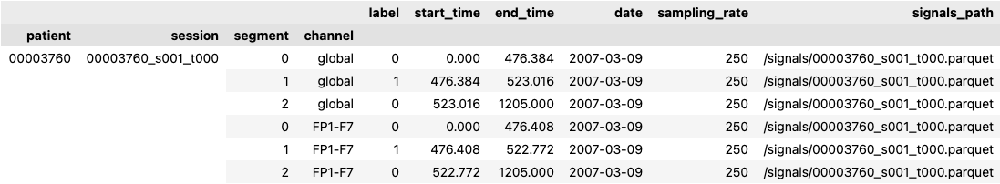
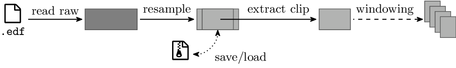

================================================================================
EEG pipeline for reproducible ML on seizure data
================================================================================

|build-status|

.. |build-status| image:: https://readthedocs.org/projects/seizure-eeg/badge/?version=latest&style=flat
    :alt: build status
    :target: https://seizure-eeg.readthedocs.io

To open the road for reproducibility in seizure-related ML tasks, we implement a
unified preprocessing library providing the functionality required to extract
EEG clips in the format required by many ML algorithms.

The package documentation is available on `readthedocs`_.

.. _`readthedocs`: https://seizure-eeg.readthedocs.io

This package provides the following functionalities:

1. Data fetching
2. Pre-processing of EEG measurements
3. Creation of clips dataframe, with relevant start and end times
4. Dataset class, which handles:

   - Data loading
   - Data transforms

The first two steps are handled by `seiz_eeg.preprocess`, whose
parameters can be set in a yaml configuration file, or passed as cli arguments.
By default, the module looks for a ``config.yaml`` file in the working
directory, but another file can be specified with the `-c` option.  A
``dataset`` must be specified with the corresponding option, either in the
``.yaml`` file, or as follows::

    python -m seiz_eeg.preprocess dataset=DATASET
    # python -m seiz_eeg.preprocess -c path/to/config.yaml

The creation of clips is provided by `seiz_eeg.clips` and the
`Dataset` is implemented in `seiz_eeg.dataset`.

More details on parameters in the `Parameters`_ section.

Installation
================================================================================

The code can be pip-installed directly from git, if you have proper
authentication. Just run::

    pip install git+https://github.com/LTS4/seizure_eeg.git

Otherwise, you can clone the repository and pip install it::

    git clone https://github.com/LTS4/seizure_eeg.git
    cd seizure_eeg
    pip install seizure_eeg

How to use
================================================================================

Download and pre-processing
--------------------------------------------------------------------------------

.. note::

    Currently, this is implemented for the `TUH seizure corpus`_ (version 1.4.2) and the `CHB-MIT`_
    dataset.

.. _`TUH seizure corpus`: https://isip.piconepress.com/projects/tuh_eeg/html/downloads.shtml
.. _`CHB-MIT`: https://physionet.org/content/chbmit/1.0.0/

Data are downloaded to a subfolder of ``raw_path``, declared in the
source-specific configuration.
Then, with functions which are tailored to different datasets, we pretreat the
the data to give them a source agnostic structure.

Segments dataframe
''''''''''''''''''''''''''''''''''''''''''''''''''''''''''''''''''''''''''''''''

EEG measurements come with little structure. To perform any data-driven task, we
shall identify relevant information and organize them.
This is generally provided in annotations files, which are separate for each
EEG scan. By preliminary reading all of such files, we can create a tabular
*annotation dataframe*, where entries are indexed by patient, session,
segment, and channel. The following image shows a sample of such
a table for the training split of the TUH Seizure corpus. Thanks to this added
structure, it is easy to define *clips of interest* and quickly retrieve the
relevant signals file, which can be read and processed.

EEG signals
''''''''''''''''''''''''''''''''''''''''''''''''''''''''''''''''''''''''''''''''

In the usual pre-processing of EEG signals we read raw signals from a ``.edf`` file
and resample them to the desired rate. Then we extract one clip of interest,
e.g. the first seconds of a seizure, and we optionally split it in windows.
Those can then be further transformed or fed to a model. Since many clips can be
extracted out of the same file, it is convenient to save the resampled signal
and avoid repeating expensive operations.

Datasets
================================================================================

TUH Seizure corpus
--------------------------------------------------------------------------------

This corpus consists in many hours of labelled EEG sessions.
The ``seiz_eeg.preprocess.tusz`` module provides code specific to this dataset annotations
and EEG measurements.

To download the data, you need to register (free account).
You will get a password and a username, which we recommend exporting to environment variables `TUSZ_USER` and `TUSZ_PW`.
The password shall be included in the ``config.yaml`` file, or passed to
the command line as follows:

.. code-block:: sh

    python -m seiz_eeg.preprocess dataset=tusz tusz.user=$TUSZ_USER tusz.password=$TUSZ_PW

If you get a ``"Permission denied, please try again."`` message it is probably
because your password is wrong.

More information about the TUH seizure corpus can be found on the `TUH EEG
Corpus website`_.

.. _`TUH EEG Corpus website`:
    https://isip.piconepress.com/projects/tuh_eeg/html/downloads.shtml

.. note::

    In the USA the electric nerwork has a frequency of 60Hz, which should be removed from the data.

Parameters
================================================================================

Many parameters are available for data processing and they shall provided as
*configuration* dataclasses (specified in ``seiz_eeg.config.py``) to our functions.

The minimal parameter needed are
- ``dataset``, which specifies the dataset to preprocess.
- ``raw_root``, which specifies the root folder where the raw data is stored.

.. warning::

    Preprocessing parameters are not yet unified across datasets.

We use OmegaConf_ to merge ``.yaml`` files configuration and cli options in our
runnable script (``seiz_eeg.preprocess``).
An example of configuration file for TUH Seizure corpus is provided in |config|_.
The config file, or cli options can provide the following parameters:

.. code-block::

    config (DataConf)
    │
    ├── dataset (str):                              Abbrv. of dataset to preprocess. Currently supported:
    │                                                   - tusz: TUH Seizure Corpus
    │                                                   - chbmit: CHB-MIT Scalp EEG Database
    │
    ├── raw_root (str):                             Root folder for raw data (downloads)
    │
    ├── processed_root (str):                       Root folder for preprocessed data
    │
    ├── labels (DataLabelsConf):                    Seizure labels specifications
    │   ├── map (Dict[str, int]):                       Map from string seizure codes to integers, e.g. ``bkgd -> 0`` and ``fnsz -> 1``
    │   │
    │   └── binary (bool):                              Wheter to read binary labels
    │
    ├── signals (DataSignalsConf):                  Options for signals and clips processing
    │   ├── diff_channels (bool):                       Wheter to compute channels diffrerences, e.g. "T3-T5", "P4-O2", etc.
    │   ├── sampling_rate (int):                        Desired sampling rate, in Hz
    │   ├── clip_length (float):                        Lenght of clips to extract, in seconds
    │   ├── clip_stride (Union[float, str]):       Stride to extract the start times of the clips.
    │   │                                               Integer or real values give explicit stride, in seconds.
    │   │                                               If string, must be one of the following:
    │   │                                                   - "start": extract one clip per segment, starting at onset/termination label.
    │   │
    │   ├── window_len (float):                         Lenght of windows to split the clip in in seconds.
    │   │                                               If negative no windowing is performed.
    │   │
    │   ├── fft_coeffs (Optional[List[Optional[int]]]): FFT coefficient interval: *[min_index, max_index]*.
    │   │                                               Include all with ``[None]`` or switch off FFT with ``None``.
    │   │
    │   └── node_level (bool):                          Wheter to work with node-level or global labels
    │
    └── tusz (DataSourceConf):                      Dataset parameters for TUH Seizure Corpus
        ├── version (str):                              Dataset version
        ├── force_download (bool):                      Download data even if they are already present
        ├── raw (str):                                  Path where to save raw data
        ├── processed (str):                            Path where to save preprocessed data
        ├── subsets (List[str]):                        List of subsets to include in preprocessing (e.g. ``["train", "test"]``)
        └── excluded_patients (Dict[str, List[str]]):   Map from subset to list of patients to exclude from it.

.. _OmegaConf: https://omegaconf.readthedocs.io/en/latest/

.. |config| replace:: ``config.yaml``
.. _config: https://github.com/LTS4/seizure_eeg/blob/main/config.yaml
