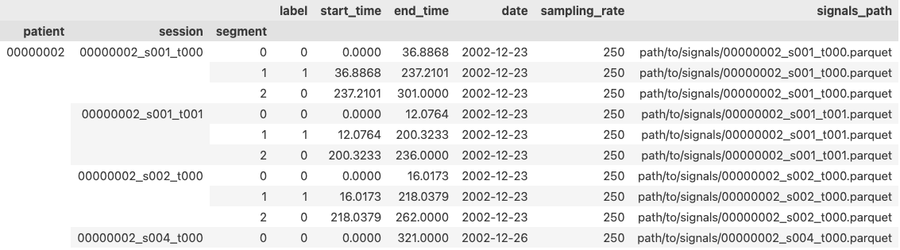

.. |eegdatset_tutorial| replace:: Loading signals with ``EEGDataset``
.. |TUH| replace:: Temple University Seizure Corpus

=============================================
Handling events and EEG dataframes
=============================================

This tutorial shows what you will find in the segments dataframe, how to split it into clips and how to load corresponding parts of EEG recordings with the :mod:`seiz_eeg` package.

We suppose that you have an annotation dataframe, here called ``segments.parquet``, which contains annotation for EEG events with the following format

=========== =========== ===========  ========= ============== ============ ============== ================= ================
Multiindex                           Columns
-----------------------------------  ---------------------------------------------------------------------------------------
``patient`` ``session`` ``segment``  ``label`` ``start_time`` ``end_time`` ``date``       ``sampling_rate`` ``signals_path``
=========== =========== ===========  ========= ============== ============ ============== ================= ================
str         str         int          int       float          float        datetime       int               str
=========== =========== ===========  ========= ============== ============ ============== ================= ================

The annoations are represented as :class:`pandas.DataFrame` with hierarchical indexing. For more information on advaced pandas indexing, we refer you to `pandas documentation`_.

.. _`pandas documentation`: https://pandas.pydata.org/docs/user_guide/advanced.html

Reading annotations
===================

We can read an annotation file stored at ``path/to/segments.parquet`` directly as a dataframe with the following code::

    import pandas as pd

    df = pd.read_parquet("path/to/segments.parquet")

We could then ispect the content of the first 10 lines, and sort them by index::

    print(df.head(10).sort_index())

Which for the annotations of the train set of |TUH|  would give the following:

As you can see, the ``signals_path`` points to the same file for all segments belonging to the same ``session`` (recording).
These files contain contiguous recordings which can span multiple events. One can manually load them, or use the
provided :class:`seiz_eeg.dataset.EEGDataset` class, which allows to easily fetch segment signals. We give an example of its usage in the |eegdatset_tutorial|_ section.

Filtering events
================

The :mod:`seiz_eeg.utils` module provide multiple functions that can be helpful to filter the data in the annotation dataframe.

For instance, we might only be interested in sessions that contain either non-ictal activity (label 0), or generalized
seizures (label 3). We can filter them with the :func:`seiz_eeg.utils.sessions_by_labels` function, and relabel them to 0 and 1 respectively, by running::

    df = sessions_by_labels(df, target_labels=[0,3], relabel=True)

Otherwise, we might be interested in working only with patients that have at least one seizure, but no more than 30 of
them. For this purpose, we can use the :func:`seiz_eeg.utils.patients_by_seizures` function::

    df = patients_by_seizures(df, low=1, high=30)

Note that most of the functions in :mod:`seiz_eeg.utils` take as input an annotation dataframe, and return an object
following the same schema. This allows to concatenate multiple preprocessing steps in a streamline pipeline.
For readibility, we suggest to use the :meth:`pandas.DataFrame.pipe` method, which allows us to write::

    df = (
        pd.read_parquet("path/to/segments.parquet")
        .pipe(sessions_by_labels, target_labels=[0,3], relabel=True)
        .pipe(patients_by_seizures, low=1, high=30)
    )

Getting clips of the same length
================================

In case you need to work

|eegdatset_tutorial|
===================================

:class:`seiz_eeg.dataset.EEGDataset`.
